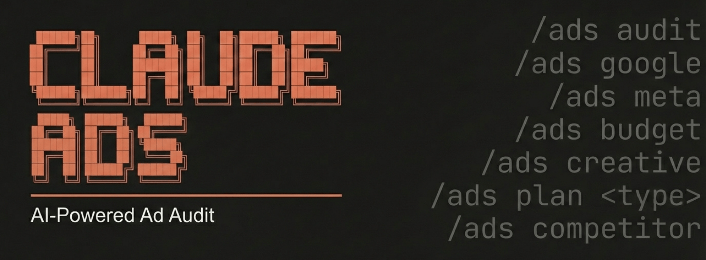
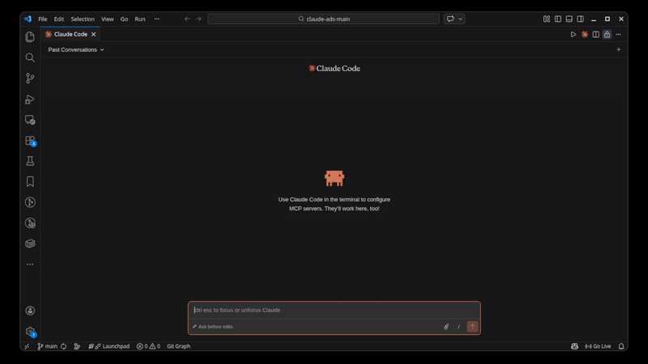

<p align="center">
  
</p>

# Antigravity Ads: Paid Advertising Audit Skill

Comprehensive paid advertising audit and optimization skill for **Antigravity**. Covers Google Ads, Meta Ads, YouTube Ads, LinkedIn Ads, TikTok Ads, Microsoft Ads, and Apple Ads with **250+ audit checks**, industry-specific templates, parallel subagent delegation, PPC financial modeling, A/B test design, and PDF report generation.

This is a fork of the original [claude-ads](https://github.com/AgriciDaniel/claude-ads) repository, heavily modified and re-architected to run natively as an Antigravity skill using natural language triggers rather than CLI slash commands.

[]()
[](LICENSE)

## Contents

- [Installation](#installation)
- [Demo](#demo)
- [Quick Start](#quick-start)
- [Features](#features)
- [Architecture](#architecture)
- [How It Analyzes Your Ads](#how-it-analyzes-your-ads)
- [FAQ](#faq)
- [Requirements](#requirements)

## Installation

### One-Command Install (Windows PowerShell)

```powershell
irm https://raw.githubusercontent.com/kutzki/antigravity-ads/main/install.ps1 | iex
```

### One-Command Install (Unix/macOS/Linux)

```bash
curl -fsSL https://raw.githubusercontent.com/kutzki/antigravity-ads/main/install.sh | bash
```

### Manual Install

```bash
git clone https://github.com/kutzki/antigravity-ads.git
cd antigravity-ads
./install.sh          # Unix/macOS/Linux
# OR
.\install.ps1         # Windows PowerShell
```

## Demo

<p align="center">
  
</p>

## Quick Start

Just ask Antigravity! Instead of rigid `/slash` commands, this skill uses natural language intent routing:

- *"Run a full ads audit on my SaaS company, I spend $5k/mo on Google and Meta."*
- *"Audit my Meta Ads creative diversity."*
- *"Create an ad plan for my e-commerce business."*
- *"Extract the brand DNA from [url] and generate a campaign concept."*
- *"Review my Google Ads budget allocation."*

The orchestrator will automatically collect missing context, select the appropriate sub-module, and execute the task!

<p align="center">
  
</p>

## Features

### 250+ Audit Checks
Comprehensive coverage across all platforms with weighted severity scoring:

| Platform | Checks | Key Areas |
|----------|--------|-----------|
| Google Ads | 80 | Search, PMax, AI Max, Demand Gen, CTV, YouTube |
| Meta Ads | 50 | Pixel/CAPI, Andromeda creative diversity, Structure, Audience |
| LinkedIn Ads | 27 | B2B targeting, TLA, Lead Gen, CRM integration |
| TikTok Ads | 28 | Creative-first, Smart+, GMV Max, Search Ads, Events API |
| Microsoft Ads | 24 | Google import safety, Copilot, CTV, LinkedIn targeting, video |
| Apple Ads | 35+ | Campaign structure, CPPs, Maximize Conversions, AdAttributionKit |
| Cross-platform | 3 | Privacy infrastructure, creative diversity, refresh cadence |

### Quality Gates
Hard rules enforced during every audit:
- Never recommend Broad Match without Smart Bidding (Google)
- 3x Kill Rule: flag CPA >3x target for immediate pause
- Budget sufficiency: Meta >=5x CPA/ad set, TikTok >=50x CPA/ad group
- Learning phase protection: no edits during active learning
- Compliance: auto-check Special Ad Categories (housing/credit/finance)

### Creative Pipeline

AI-powered creative generation with specialized agents that extract brand DNA, create campaign concepts, write copy, and generate imagery using your configured `image_provider` (Gemini by default).

## Architecture

The system has been restructured for Antigravity's unified skill loading:

```
~/.gemini/antigravity/skills/antigravity-ads/
  ├── SKILL.md             # Main orchestrator (Natural Language Router)
  ├── modules/             # 17 sub-skills (Google, Meta, Creative, etc.)
  ├── references/          # 25 RAG reference files
  ├── agents/              # 10 agents (6 audit + 4 creative)
  └── scripts/             # Python tools (PDF generation, landing page parsing)
```

## How It Analyzes Your Ads

**Antigravity Ads works with data you provide**; exports, screenshots, or pasted metrics from your ad platform dashboards. It does not connect to any ad platform API automatically unless paired with an MCP server like `mcp-google-ads`.

**To get accurate, account-specific recommendations:**
1. Export your account data (last 30 days recommended)
2. Ask Antigravity to run an audit.
3. Antigravity will ask for your industry and budget context first; provide these for relevant benchmarks
4. Paste or share your data when prompted.

## Requirements

- Antigravity
- Python 3.10+ (for `playwright` and `reportlab` tools)

## License

MIT License - see [LICENSE](LICENSE) for details.

---

*Forked and customized for Antigravity based on the original `claude-ads` project by Agrici Daniel.*

